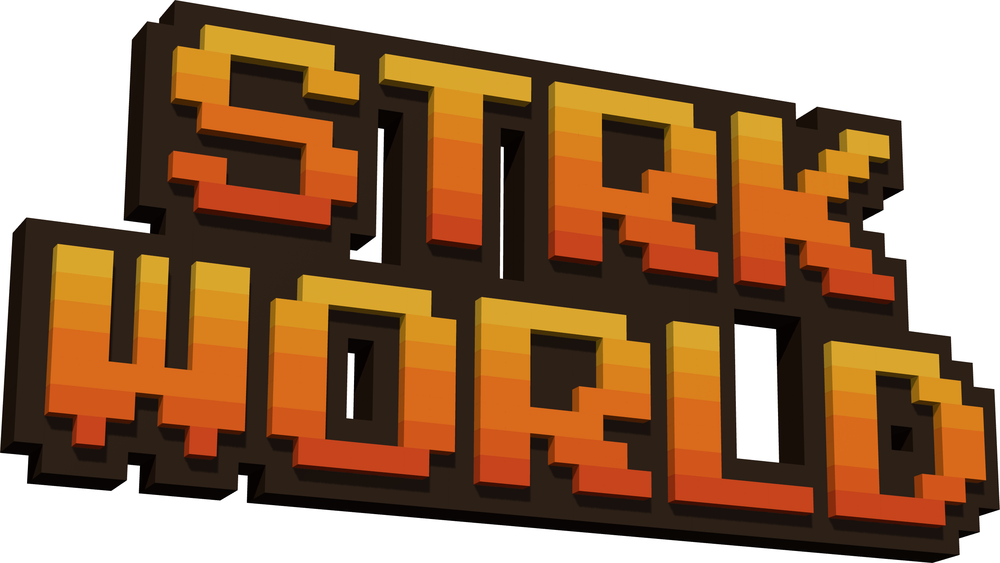

# STRKWORLD brand

STRKWORLD's brand is **Direction A, "Built from blocks"**. The name is built from the same cubes as the world and lit by the street's golden-hour sun. Its type is taken from game title screens and scoreboards, not from product UI.

Approved 2026-10-02 (D-113). The references were Cube World's title and menu screens: chunky pixel lettering, a hot orange-to-gold fill, a thick dark outline with a 3D drop, and small outlined pixel menus.

## Wordmark

- **File:** `assets/wordmark.png` is a transparent PNG at 2658×1498. Use it as supplied, and don't redraw or recolour it.
- **Construction:**
  - "STRK" sits stacked over "WORLD". Every letter is built from cubes on an 8px pixel grid, taken from Press Start 2P's bitmaps.
  - Letters are spaced by their own ink, one cube apart. The font's built-in spacing isn't used, because it left a gap after the S.
  - The front faces carry an orange-to-gold gradient, from `#FFD23A` at the top to `#E8501A` at the bottom. A row of dark-orange cubes (`#B8400C`) sits behind them as the drop.
  - A dark outline shell (`#24120A`) surrounds the whole mark.
- **Lighting:** it uses the game's own sun and hemisphere light, with no tone mapping. The camera sits at yaw −24° and pitch −16°.
- **Clear space:** leave at least the height of one letter row on every side.
- **Backgrounds:** it reads best over sky or over the world scene. On flat colour, use the sky-to-horizon gradient or the dark panel.
- **Re-rendering:** use the brand render tool, [`packages/world/tools/brand-render/`](../../packages/world/tools/brand-render/README.md); its README has the exact command.

## Type

| Role | Font | Notes |
|---|---|---|
| Headlines and titles | **Jersey 15** | A tall, condensed pixel face with a scoreboard feel. Set it large with tight leading (line-height about 0.95). Not for money amounts: its 8/B and 6/8 merge (D-121). |
| Body and money amounts | **VT323** | A pixel terminal face. Every amount and balance uses it with tabular figures (D-121). It reads small, so set it about 1.35× the size a normal sans would need: 20px minimum on screens, with line-height about 1.2. |
| Buttons, tabs, menus, labels | **Silkscreen** | Pixel caps at weight 400 or 700, with slight letter-spacing. |

All three are Google Fonts under the SIL Open Font License, so commercial use is fine. Self-host them in the app.

## Palette

| Token | Hex | Where it comes from |
|---|---|---|
| Ember | `#F56A16` | Wordmark base; primary buttons |
| Sun gold | `#FFC12E` | Wordmark top; highlights |
| Outline | `#24120A` | Wordmark outline; button and window outlines and drops |
| Horizon | `#F2DCC0` | The game's horizon and fog (`SKY_HORIZON` in `packages/world/src/three/sky.ts`) |
| Sky | `#6F9EDB` | The game's sky dome top (`SKY_TOP`, same file) |
| Grass | `#86AD55` | Street grass (`PALETTE.grassWarm` in `packages/world/src/three/palette.ts`) |

Partner buildings keep their own brand colours and type inside their refits: the STRK20 Bank, the avnu Exchange, the NEAR Bridge and the Vesu Vault. The STRKWORLD brand is the world around them.

## Components

- **Button:**
  - Silkscreen caps in cream (`#FFF6E6`) on an Ember block with a slight corner radius (about 6% of its height).
  - It has a 3–4px Outline border and a solid Outline drop of about 10% of its height below it. The drop is hard, with no blur.
- **Window or panel:**
  - Cream (`#FFF7EA`) or dark brown (`#261810`) fill, with a 12px Outline border and the same hard Outline drop.
  - Dark windows add a 6px inner rim in `#6E3E1E`, so the border stays visible.
  - A soft ambient shadow underneath is fine.
- **Menus:** Silkscreen caps. Mark the selected item with ▶ and the Ember or Sun gold colour.

## Social kit (`assets/social/`)

| File | Use |
|---|---|
| `banner-armour-1500x500.png` | X/Twitter header: all eight characters in fighting outfits, with the wordmark top-left, clear of the profile picture |
| `banner-casual-1500x500.png` | The same header with everyone in their cosy outfits |
| `profile-800.png` | Profile picture: a close-up of Avatar 1 rendered from the game |
| `square-window-{light,dark}-1080.png` | Square post backgrounds with an empty window to type into |
| `square-window-{light,dark}-logo-1080.png` | The same squares with the wordmark on the window's top edge |

**Provenance:**
- The characters, the wordmark and the profile picture were rendered on 2026-10-02 from this repository's own code: `avatar-figure.ts`, `avatar-looks.ts` and `lighting.ts` in `packages/world/src/three/`, through the brand render tool (`packages/world/tools/brand-render/`).
- The stylised world backdrop behind the banners and squares is an AI-generated illustration. It was made with SpriteCook (gpt-image-2), using a render of the real street from `buildStreet()` as the reference image.
- The fonts are Google Fonts under the SIL Open Font License: Press Start 2P's bitmaps for the wordmark's letterforms, and Jersey 15, VT323 and Silkscreen for type.
- No third-party logos or characters are copied. The Vesu logo on the Vault roof is the in-game building's own sign.

## Favicon and app icons (`apps/web/public/`)

- `favicon.ico` (16, 32 and 48 px), `favicon-16x16.png`, `favicon-32x32.png`, `apple-touch-icon.png` (180 px on the brand sky gradient), and transparent `icon-192.png` and `icon-512.png` for `site.webmanifest`. The 1600 px source is `assets/favicon-source.png`.
- They are a close-up of Avatar 1's head, rendered from `avatar-figure.ts` and `lighting.ts` through `packages/world/tools/brand-render` in portrait mode (`?mode=portrait&key=1&yaw=0&span=1.05&fov=12&pitch=6&fill=0.9&aim=1.0`), cropped to the head, with a thin Outline (`#24120A`) ring.

## Don't

- Don't use rounded system or UI fonts (SF Pro Rounded, Nunito and similar) for brand surfaces. They are what made earlier material look generic.
- Don't put soft, blurred drop shadows on buttons. The drop is a solid block.
- Don't use the old 2D pixel sprite sheets (`packages/world/assets/player-sprites/`) for brand art. The game is 3D now.
